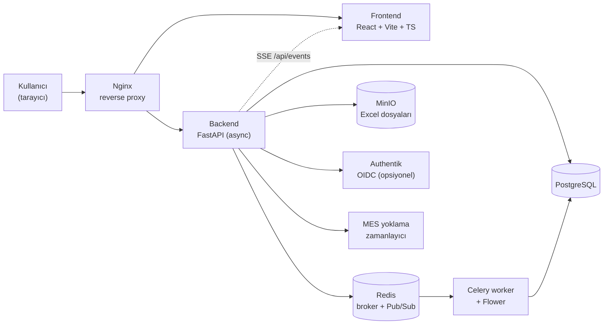

# Üretim Takip — Dinamik Üretim Planlama Sistemi

Elektronik üretim yapan bir işletmenin sipariş, teslimat ve üretim planlamasını tek ekrandan
yönetmek için geliştirdiğim web tabanlı planlama sistemi. Excel'den içeri alınan sipariş verileri,
sürükle-bırak ile düzenlenebilen hiyerarşik bir Gantt çizelgesine dönüşür; her siparişin
tedarik → dizgi → üretim → test → teslimat adımları iş günü, resmi tatil ve personel kapasitesi
dikkate alınarak otomatik olarak hesaplanır.

Proje, zorunlu yaz stajım kapsamında baştan sona tarafımdan tasarlanıp geliştirilmiştir.
Bu depo yazılımın **veri içermeyen** (boş veritabanı ile çalışan) sürümüdür.

---

## İçindekiler

- [Öne Çıkan Özellikler](#öne-çıkan-özellikler)
- [Mimari](#mimari)
- [Teknoloji Yığını](#teknoloji-yığını)
- [Kurulum](#kurulum)
- [Ortam Değişkenleri](#ortam-değişkenleri)
- [Geliştirme](#geliştirme)
- [Testler](#testler)
- [Proje Yapısı](#proje-yapısı)
- [Üretim Ortamına Alma](#üretim-ortamına-alma)

---

## Öne Çıkan Özellikler

### Planlama
- **Hiyerarşik Gantt** — Sipariş / teslimat parçası / üretim adımı olmak üzere üç seviyeli,
  sıfırdan yazılmış (harici Gantt kütüphanesi kullanmayan) çizelge bileşeni.
- **Otomatik adım hesabı** — Ürün bilgisindeki birim sürelerden yola çıkarak tedarik, dizgi,
  üretim, test ve teslimat adımlarının başlangıç/bitiş tarihleri hesaplanır.
- **İş günü takvimi** — Hafta sonları ve yönetilebilir resmi tatil listesi (miladi + hicri
  bayram hesabı) süre hesaplarının dışında tutulur.
- **Personel kapasitesi** — Adıma atanan kişi sayısı (ondalıklı olabilir) süreyi doğrudan
  etkiler; adım bazında kişi ataması yapılabilir.
- **Teslimat bölme (split)** — Bir sipariş birden fazla parçaya bölünebilir, her parça bağımsız
  olarak planlanır ve takip edilir.
- **BOM / alt ürün zinciri** — Bileşen siparişleri ana siparişe bağlanır; ana siparişin üretimi
  bileşenlerin bitiş tarihine göre kapılanır (gate).
- **Fason (dış dizgi)** desteği ve adım bazında manuel süre/parametre override'ı.

### Veri Girişi
- **Excel içe aktarma** — Yüklenen `.xlsx` dosyası MinIO'ya kaydedilir, pandas ile okunur.
- **Eşleme şablonları (mapping templates)** — Farklı formatlardaki Excel sütunları, kayıtlı
  şablonlarla sistem alanlarına eşlenir.
- **Diff & merge** — Yeni yüklenen dosya mevcut veriyle karşılaştırılır; eklenen, silinen ve
  değişen satırlar kullanıcıya onaylatılmadan uygulanmaz.
- **Satın alma ayrıştırıcı** — Tedarikçi tekliflerini PDF, Excel ve Outlook `.msg` dosyalarından
  otomatik ayrıştırıp tabloya dönüştürür.

### Takip ve Operasyon
- **Seri numarası takibi** — Her ürün adedi, üretim aşamaları boyunca ayrı ayrı izlenir.
- **MES entegrasyonu** — Arka plan görevi MES uç noktasını periyodik yoklayarak seri numarası
  aşamalarını günceller (depoda örnek/dummy uç nokta ile birlikte gelir).
- **Gerçek zamanlı senkronizasyon** — Redis Pub/Sub + SSE ile açık tüm istemciler anında güncellenir.
- **Denetim izleri (audit log)** — Oluşturma, güncelleme, silme, sürükleme ve bölme işlemleri
  kullanıcı ve zaman damgasıyla kaydedilir, kayıtlara not düşülebilir.
- **Otomatik yedekleme** — Zamanlanmış veritabanı yedeği, saklama politikası ve arayüzden geri yükleme.
- **E-posta bildirimi** — Sipariş tamamlandığında ve satın alma kaydı oluştuğunda otomatik bildirim.
- **İstek/öneri/şikâyet modülü** — Kullanıcıların uygulama içinden geri bildirim bırakması.

### Kullanıcı ve Güvenlik
- JWT tabanlı kimlik doğrulama (HTTP-only cookie ile refresh token).
- Rol tabanlı yetkilendirme: `ADMIN`, `PLANNER`, `VIEWER`.
- Kayıt olan kullanıcılar için yönetici onayı akışı.
- İsteğe bağlı **Authentik (OIDC) SSO** — grup eşlemesi ile otomatik rol ataması.
- Görünüm ayarları (açık/koyu tema, renk paleti, kolon tercihleri) kullanıcı bazında saklanır.

---

## Mimari



**Akış:** Excel yüklenir → MinIO'ya konur → eşleme şablonuyla ayrıştırılır → mevcut veriyle
diff alınır → onaylanan değişiklikler `orders` ve `delivery_splits` tablolarına yazılır →
planlama motoru adım tarihlerini hesaplar → Gantt ve takvim ekranları SSE üzerinden anında
güncellenir.

---

## Teknoloji Yığını

| Katman | Teknolojiler |
| --- | --- |
| Backend | Python 3.11, FastAPI, SQLAlchemy 2.0 (async), Alembic, Pydantic v2 |
| Veritabanı | PostgreSQL 16 |
| Kuyruk / Cache | Redis 7, Celery, Flower |
| Nesne Depolama | MinIO |
| Frontend | React 18, TypeScript, Vite, Tailwind CSS, React Router, Axios |
| Dosya İşleme | pandas, openpyxl, pdf.js, SheetJS (xlsx), msgreader |
| Kimlik | JWT (python-jose), passlib/bcrypt, Authentik (OIDC) |
| Altyapı | Docker, Docker Compose, Nginx, Let's Encrypt |
| Test | pytest, Vitest |

---

## Kurulum

### Gereksinimler
- Docker ve Docker Compose
- (Yalnızca Docker'sız geliştirme için) Python 3.11+, Node.js 20+

### Adımlar

```bash
git clone https://github.com/atahaniskl/uretimtakip.git
cd uretimtakip

# Ortam değişkenlerini hazırla
cp .env.example .env
# .env içindeki tüm CHANGE_ME değerlerini doldurun:
#   openssl rand -hex 32   →  güçlü parola/anahtar üretmek için

# Servisleri ayağa kaldır
docker compose up -d --build
```

Servisler ayağa kalktığında:

| Servis | Adres |
| --- | --- |
| Uygulama (Nginx) | http://localhost |
| Frontend (Vite dev) | http://localhost:3000 |
| Backend API | http://localhost:8000 |
| API dokümantasyonu (Swagger) | http://localhost:8000/api/docs |
| Flower (Celery izleme) | http://localhost:5555 |
| MinIO konsolu | http://localhost:9001 |
| Authentik (opsiyonel) | http://localhost:9005 |

Veritabanı tabloları uygulama ilk açılışta oluşturulur. Şema değişikliklerini takip etmek için
Alembic kullanılır:

```bash
docker compose exec backend alembic upgrade head
```

Kayıt ekranından oluşturulan kullanıcılar `VIEWER` rolüyle ve **onay bekler** durumda açılır.
Sistemdeki ilk yöneticiyi doğrudan veritabanından yükseltmeniz gerekir:

```bash
docker compose exec postgres psql -U dps_user -d dps_database \
  -c "UPDATE users SET role='ADMIN', is_approved=true WHERE username='kullanici_adiniz';"
```

Sonraki kullanıcılar arayüzdeki **Kullanıcılar** ekranından onaylanıp yetkilendirilebilir.

---

## Ortam Değişkenleri

Tüm yapılandırma `.env` dosyası üzerinden yapılır — şablon için `.env.example` dosyasına bakın.
Öne çıkan başlıklar:

| Değişken | Açıklama |
| --- | --- |
| `POSTGRES_*` | Veritabanı kullanıcı adı, parola, veritabanı adı |
| `REDIS_PASSWORD` | Redis parolası (broker ve Pub/Sub için ortak) |
| `MINIO_*` | Nesne depolama erişim bilgileri ve bucket adı |
| `JWT_SECRET_KEY` | Token imzalama anahtarı — **üretimde mutlaka değiştirin** |
| `AUTHENTIK_*` | OIDC SSO ayarları (`AUTHENTIK_ENABLED=false` ile kapatılabilir) |
| `SMTP_*` | Bildirim e-postaları için SMTP bilgileri |
| `DOMAIN_NAME`, `SSL_EMAIL` | Üretim dağıtımı ve Let's Encrypt sertifikası için |

Frontend tarafında `frontend/.env` dosyası kullanılır (`frontend/.env.example` dosyasından
kopyalayın):

| Değişken | Açıklama |
| --- | --- |
| `VITE_COMPANY_NAME` | Satın alma teklif ayrıştırıcısında "müşteri" olarak aranan kendi firma adınız |

> `.env` dosyaları `.gitignore` içindedir; gerçek parolalar depoya **asla** girmez.

---

## Geliştirme

Docker olmadan çalıştırmak için:

```bash
# Backend
cd backend
python -m venv .venv && source .venv/bin/activate
pip install -r requirements.txt -r requirements-dev.txt
uvicorn app.main:app --reload

# Frontend (ayrı bir terminalde)
cd frontend
npm install
npm run dev
```

PostgreSQL, Redis ve MinIO'yu yine de Docker ile ayağa kaldırmanız gerekir:

```bash
docker compose up -d postgres redis minio
```

---

## Testler

```bash
# Backend
cd backend && pytest

# Frontend
cd frontend && npm test
```

Frontend testleri, planlama matematiğinin (iş günü hesabı, adım sıralaması, süre modları)
backend ile **birebir aynı sonucu** ürettiğini doğrulayan "golden" testler içerir —
`backend/tests/generate_frontend_golden.py` betiği bu referans verisini üretir.

---

## Proje Yapısı

```
uretimtakip/
├── backend/
│   ├── app/
│   │   ├── api/v1/endpoints/   # REST uç noktaları (orders, gantt, excel, auth, …)
│   │   ├── core/               # Güvenlik, JWT, ortak yardımcılar
│   │   ├── models/             # SQLAlchemy modelleri
│   │   ├── schemas/            # Pydantic şemaları
│   │   ├── services/           # İş mantığı (planlama, Excel, yedekleme, e-posta, SSE)
│   │   ├── tasks/              # Celery görevleri
│   │   ├── config.py           # Ortam değişkeni tabanlı ayarlar
│   │   └── main.py             # Uygulama girişi
│   ├── alembic/versions/       # Veritabanı migration'ları
│   └── tests/
├── frontend/
│   └── src/
│       ├── components/         # Gantt, takvim, modal ve editör bileşenleri
│       ├── pages/              # Sayfalar (teslimat takvimi, istatistik, ayarlar, …)
│       ├── lib/                # Planlama matematiği, API istemcisi, ayrıştırıcılar
│       └── contexts/           # Auth context
├── nginx/                      # Reverse proxy yapılandırmaları (http / https / prod)
├── docker-compose.yml          # Geliştirme ortamı
├── docker-compose.prod.yml     # Üretim ortamı
├── deploy.sh                   # Üretim dağıtım betiği
└── setup-ssl.sh                # Let's Encrypt sertifika kurulumu
```

---

## Üretim Ortamına Alma

```bash
cp .env.example .env      # DOMAIN_NAME ve tüm CHANGE_ME değerlerini doldurun
./deploy.sh               # docker-compose.prod.yml ile derler ve ayağa kaldırır
./setup-ssl.sh            # Let's Encrypt sertifikasını alır, HTTPS'e geçirir
```

Üretim yapılandırmasında frontend statik olarak derlenip Nginx üzerinden sunulur, servis
portları dışarıya kapatılır ve yalnızca 80/443 açık kalır.
